# Results of Testing

The test results show the actual outcome of the testing, following the [Test Plan](test-plan.md)
This is the map of my game:

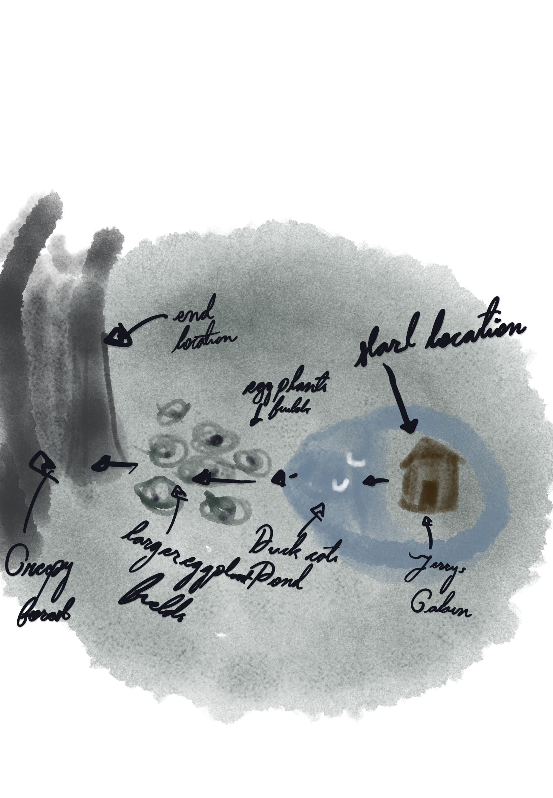

---

## Boundary - Testing the players ability to travel to the boundries of the map

Testing the boundary on the left side (Jerry's forest), and the right side (Jerry's cabin)

### Test Data Used

Jerry's cabin; the first location at map[0], and Jerry's forest at map[4].

### Test Result

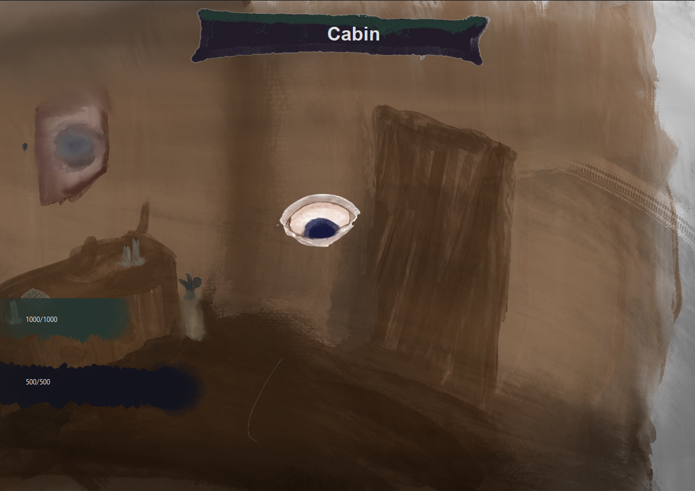

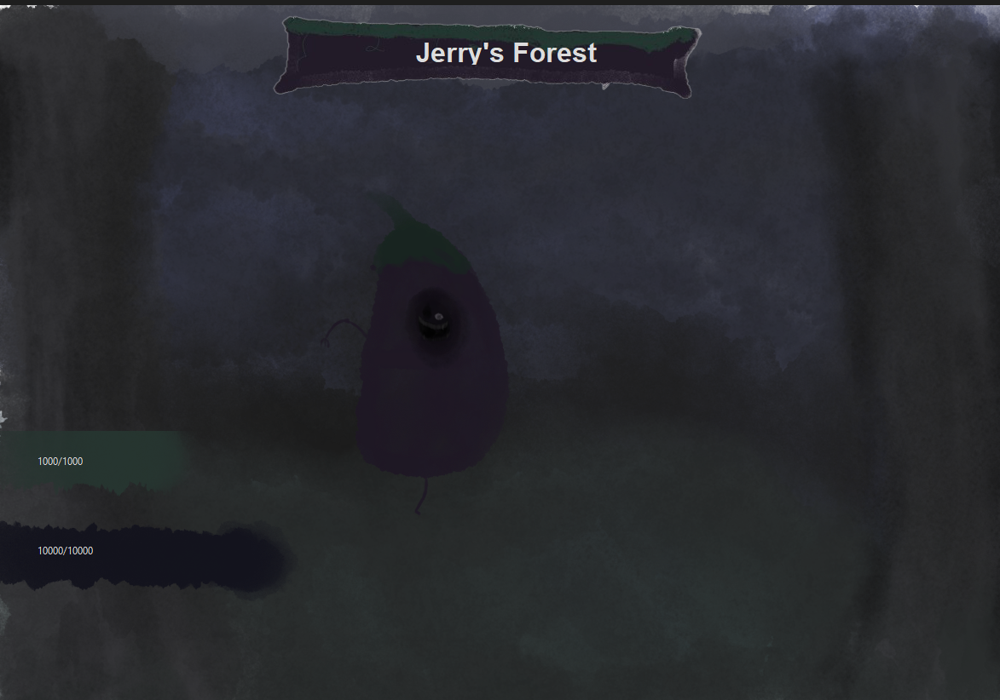

The player can be in both the first and final rooms.

---

## Valid - Enemys showing up in the correct rooms

When enemies show up in the room they're supposed to.

### Test Data Used

I will use room 2, woman-mans fields and woman man to test this.

### Test Result

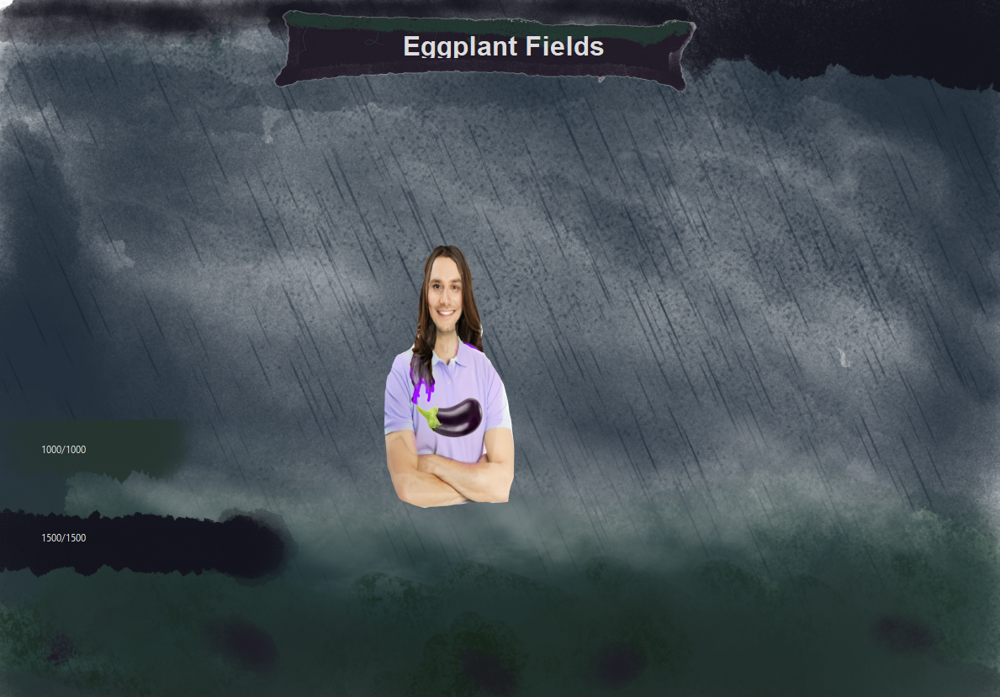

Woman-man shows up in room 4, where she is supposed to.

---

## Invalid - Player cannot travel outside the map

Making sure the player can't travel to the location before the first one.

### Test Data Used

I will try to travel right from map[0]

### Test Result

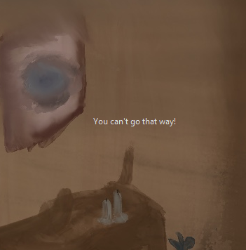

The program informs the user they cannot go that way

---

## Invalid & Valid - user cannot travel until the weapon has been picked up

When the enemy is killed, the user cannot travel until they have picked up the weapon the enemy dropped

### Test Data Used

I will try to move on from map[0] while the weapon hasn't been picked up, then pick up the weapon and the travel buttons

### Test Result

The buttons enable once the weapon has been picked up, until they the buttons disable.

---

## Valid - testing that weapon damage is correct

Testing that the weapon damage gets multiplied by the damage multiplier

### Test Data Used

I picked up the weapon in map[2], then print out the damage multiplier.

### Test Result

The damage returned from the function was 300, because the weapon multiplier for the previous room was 3, and the player
base damage is 100.

---

## Valid - testing that the random damage stays between 10-50

Testing that the random addition to the damage stays between 10-50 damage

### Test Data Used

I printed out the random damage element 10 times, and checked if it went in or out of those bounds.

### Test Result

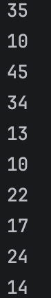

All the random damage elements stayed in the bounds of 10 and 50

---

## Valid - Enemy takes the correct amount of damage

Testing that the enemy takes the amount of damage it's supposed to

### Test Data Used

I printed out the amount of damage done, and then cross referenced it to the amount of damage the pop up supplies.
I also checked it against the enemys health before and after.

### Test Result

Enemy health Before

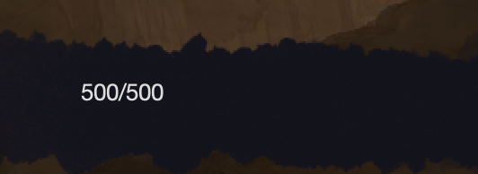

Pop up:

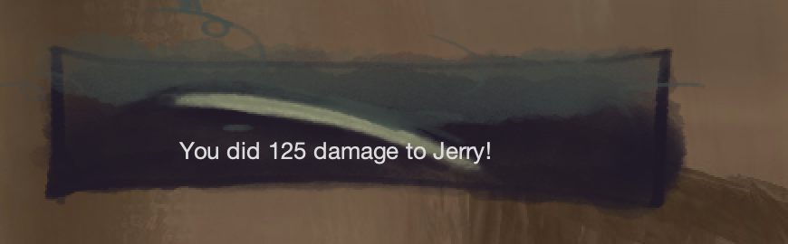

Damage dealt:

Enemy Health AFter

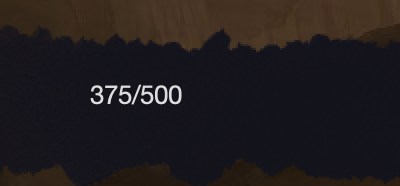

The enemy is dealt the correct amount of damage.

---

## Boundary - Enemy becomes dead once it's health hits zero

Testing that the status of the enemy becomes 'dead' once it's health hits zero, not the tick after.

### Test Data Used

I printed out the amount of health the enemy has & it's status for three different enemys.

### Test Result

Enemy 1 health:

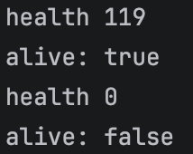

Enemy 2 health:

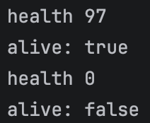

Enemy 3 health:

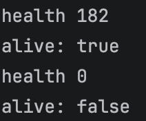

The enemy is marked dead as soon as it's health is 0

---

## Invalid - player can't move while the enemy is still alive

Testing that the player cannot change rooms while the enemy is still alive

### Test Data Used

I tried to move rooms while fighting an enemy.

### Test Result

The buttons disappear while fighting the enemy

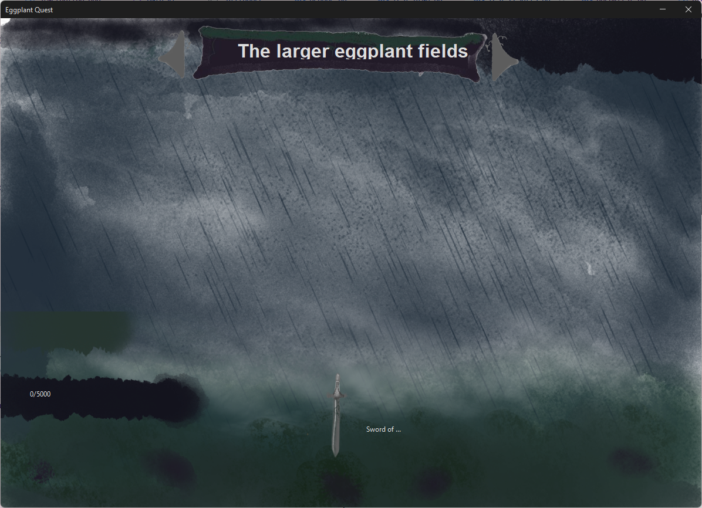

Once the enemy is dead, the buttons reappear.

---

## Valid - clicking through dialogue increments index of current dialogue

Testing that clicking through the dialogue will increase the indexOfCurrentDialogue variable.

### Test Data Used

I clicked through the dialogue while printing out the variable to see if it increases

### Test Result

The number increased.

---

## Boundary - Clicking on the last dialogue sets lastDialogue to true

Testing that when clicking on the last dialogue, it says the variable 'lastDialogue' to true.

### Test Data Used

I clicked through the dialogue while printing out the last dialogue, and when on the lsat dialogue for any given enemy

### Test Result

The eye of Jerry has three dialogues, and as you can see here, on the third dialogue, lastDialogue was set to true

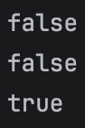

---

## Boundary - being on the last title screen sets lasttitlescreen to true

Testing that when clicking on the last title screen, it sets the variable 'lastTitleScreen' to true.

### Test Data Used

I clicked through the title screens while printing out the last titlescreen

### Test Result

On the last of the six title screens, the variable set to true

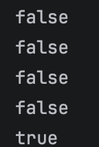

---

## Valid - testing the game is won when all locations are complete

Testing that the game is won when all the title screens are set to complete.

### Test Data Used

I completed all locations, and checked if the win screen triggered

### Result

Once I killed Jerry, the game win screen triggered.

---

## Valid - testing the is lost when the player runs out of health

Testing that the game is lost when the player health hits 0

### Test Data Used

I lost while fighting an enemy

### Test Result

Once my health ran out, the death screen triggered.

---

## Valid - the player can move from one location to the next

Testing that the player can move from one location to the next

### Test Data Used

I moved from one location to the next and back again.

### Test Result

Once the enemy was dead and the weapon was picked up, the player could move as intended.

---

## Valid - the game will show how many seconds it took the player to beat the game

Testing that, once the game is won, the game will show the player how many seconds it took them.

### Test Data Used

I beat the game and started a timer to see how long it took me.

### Test Result

Once I beat Jerry, the game showed me the correct time.

---

## Valid - clicking on the dialogue advances it forward and starts the game on the last one.

Testing that the player can click on the dialogue and it will change, and start the game.

### Test Data Used

I clicked on the dialogue and see if it advances it forward.

### Test Result

---